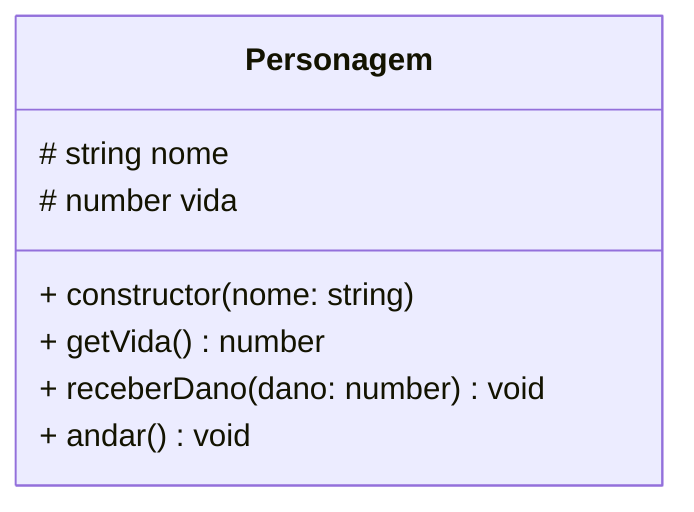
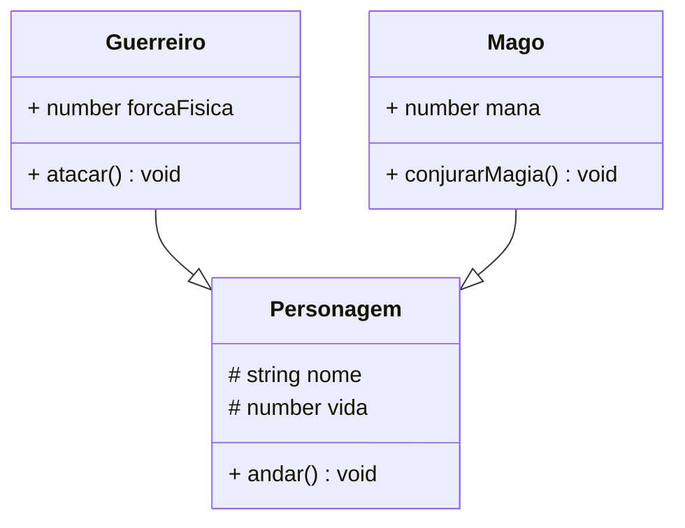

# 📖 Apostila Teórica: Herança, Polimorfismo e UML (Aetheria Engine)

Bem-vindos de volta a Aetheria! Nas aulas anteriores, nós criamos o núcleo do nosso motor instanciando objetos a partir de **Classes** e protegendo suas propriedades através do **Encapsulamento**. Mas o mundo de Aetheria está crescendo. Novos tipos de monstros e heróis estão surgindo, e se continuarmos copiando e colando código para criar cada nova criatura, nosso motor ficará gigantesco, insustentável e cheio de bugs.

Chegou a hora de dominarmos os pilares mais poderosos da Programação Orientada a Objetos: a **Herança** e o **Polimorfismo**. Mas antes de abrirmos o editor de código, precisamos aprender a desenhar a planta do nosso castelo.

---

## 1. Diagramas de Classe (UML) - A Planta Baixa do Código

Antes de um engenheiro construir um prédio, ele desenha uma planta baixa. Na engenharia de software, nós desenhamos um **Diagrama de Classes** usando a linguagem **UML** (Unified Modeling Language). 

O diagrama nos permite visualizar as Classes do nosso sistema, seus Atributos (características), Métodos (ações) e as Relações entre elas, sem escrever uma única linha de código.

### Lendo um Bloco UML
Um bloco de classe UML é dividido em 3 partes:
1. **Cabeçalho:** O nome da Classe (ex: `Personagem`).
2. **Meio:** Os Atributos (ex: `vida`, `nome`).
3. **Rodapé:** Os Métodos (ex: `andar()`, `atacar()`).

Além disso, usamos símbolos matemáticos para indicar os modificadores de acesso (Encapsulamento):
- `+` significa **Public** (Acessível por todos)
- `-` significa **Private** (Acessível apenas dentro da classe)
- `#` significa **Protected** (Acessível na classe pai e nas classes filhas)

Veja como modelamos o nosso `Personagem` básico do Aetheria:



*Representação Gráfica Alternativa (Cartão UML):*

<div style="border: 2px solid #555; width: 320px; font-family: monospace; border-radius: 5px; overflow: hidden; margin: 15px 0;">
  <div style="background-color: #f0f0f0; padding: 8px; text-align: center; font-weight: bold; border-bottom: 2px solid #555; color: #000;">Personagem</div>
  <div style="padding: 8px; border-bottom: 2px solid #555; color: #000; background-color: #fff;">
    # nome: string<br>
    # vida: number
  </div>
  <div style="padding: 8px; color: #000; background-color: #fff;">
    + constructor(nome: string)<br>
    + getVida(): number<br>
    + receberDano(dano: number): void<br>
    + andar(): void
  </div>
</div>

> **Dica de Ouro:** Repare no uso do símbolo `#` (Protected) na vida e no nome. Se eles fossem `-` (Private), os Guerreiros e Magos que criaremos logo abaixo não poderiam enxergar a própria vida! O `Protected` é o melhor amigo da Herança.

---

## 2. Herança (`extends`): O Poder da Linhagem

No Aetheria, um `Guerreiro` e um `Mago` têm muito em comum. Ambos possuem um `nome`, possuem `vida`, e ambos conseguem `andar()`. Seria terrível ter que reescrever toda essa lógica de movimento e de receber dano dentro de cada nova classe.

É aí que entra a **Herança**. A Herança permite criar uma classe "Filha" (Subclasse) que herda automaticamente todos os atributos e métodos não-privados de uma classe "Pai" (Superclasse). Em TypeScript, usamos a palavra mágica `extends`.

### Modelagem UML com Herança
No UML, a Herança é representada por uma seta com ponta vazada apontando da classe filha para a classe pai (indicando "é um(a)").



*Representação Gráfica Alternativa (Cartões de Herança):*

<div style="border: 2px solid #555; width: 320px; font-family: monospace; border-radius: 5px; overflow: hidden; margin: 15px 0;">
  <div style="background-color: #f0f0f0; padding: 8px; text-align: center; font-weight: bold; border-bottom: 2px solid #555; color: #000;">Personagem (Superclasse)</div>
  <div style="padding: 8px; border-bottom: 2px solid #555; color: #000; background-color: #fff;">
    # nome: string<br>
    # vida: number
  </div>
  <div style="padding: 8px; color: #000; background-color: #fff;">
    + andar(): void
  </div>
</div>

<div style="display: flex; gap: 20px; flex-wrap: wrap;">
  <div style="border: 2px solid #555; width: 320px; font-family: monospace; border-radius: 5px; overflow: hidden; margin-bottom: 10px;">
    <div style="background-color: #e0f7fa; padding: 8px; text-align: center; font-weight: bold; border-bottom: 2px solid #555; color: #000;">Guerreiro (extends Personagem)</div>
    <div style="padding: 8px; border-bottom: 2px solid #555; color: #000; background-color: #fff;">
      + forcaFisica: number
    </div>
    <div style="padding: 8px; color: #000; background-color: #fff;">
      + atacar(): void
    </div>
  </div>

  <div style="border: 2px solid #555; width: 320px; font-family: monospace; border-radius: 5px; overflow: hidden; margin-bottom: 10px;">
    <div style="background-color: #fff3e0; padding: 8px; text-align: center; font-weight: bold; border-bottom: 2px solid #555; color: #000;">Mago (extends Personagem)</div>
    <div style="padding: 8px; border-bottom: 2px solid #555; color: #000; background-color: #fff;">
      + mana: number
    </div>
    <div style="padding: 8px; color: #000; background-color: #fff;">
      + conjurarMagia(): void
    </div>
  </div>
</div>

### O Método `super()`
Quando uma classe filha possui o seu próprio `constructor`, ela tem a **obrigação** de acionar o construtor da classe pai para garantir que o núcleo do objeto seja construído corretamente. Fazemos isso invocando o método `super()`.

```typescript
class Personagem {
    protected nome: string;
    
    constructor(nome: string) {
        this.nome = nome;
    }
}

class Guerreiro extends Personagem {
    public forcaFisica: number;

    constructor(nome: string, forcaFisica: number) {
        // Chamando o construtor do PAI (Personagem)
        super(nome); 
        // Inicializando o atributo exclusivo do FILHO
        this.forcaFisica = forcaFisica;
    }
}
```

> **Curiosidade Nerd:** Se você esquecer de chamar o `super()` na primeira linha do construtor da classe filha, o TypeScript não deixará o seu código rodar! É como tentar dar uma espada para um guerreiro antes mesmo dele nascer.

---

## 3. Polimorfismo: Muitas Formas, Um Único Comando

*Poli* significa "muitos", *Morfo* significa "formas". O **Polimorfismo** é a capacidade de objetos de diferentes classes filhas responderem ao mesmo método, mas de maneiras completamente diferentes.

Imagine o método `atacar()`. Todos os personagens em Aetheria sabem atacar. Mas se mandarmos um Guerreiro atacar, ele dará um golpe de espada. Se mandarmos um Mago atacar, ele lançará uma bola de fogo. O verbo (método) é o mesmo, mas a execução (forma) muda.

### Sobrescrita de Métodos (Override)
Para aplicarmos o Polimorfismo, criamos o método `atacar()` na classe pai (`Personagem`), e depois o recriamos (sobrescrevemos) nas classes filhas, mudando sua lógica interna.

```typescript
class Personagem {
    // ... construtores omitidos ...
    public atacar(): void {
        console.log("O personagem dá um soco básico.");
    }
}

class Mago extends Personagem {
    public atacar(): void {
        console.log(`O Mago lança uma imensa bola de fogo letal!`);
    }
}

class Guerreiro extends Personagem {
    public atacar(): void {
        console.log(`O Guerreiro fatia o ar com sua Espada Larga!`);
    }
}
```

**Por que isso é revolucionário?**
Graças ao polimorfismo, podemos ter um exército (um Array) misturado com centenas de Magos, Guerreiros e Arqueiros. Podemos percorrer esse array mandando todos `.atacar()`, e o motor do jogo saberá exatamente qual animação ou dano aplicar para cada um, sem precisarmos fazer dezenas de `if/else` perguntando a profissão do personagem!

---

## 4. Enumerações (`enum`): O Dicionário Sagrado

Às vezes, nós precisamos de propriedades que só aceitem valores fixos e específicos. Por exemplo: O estado de um jogador no Aetheria pode ser apenas "VIVO", "MORTO" ou "ENVENENADO". Se usarmos uma simples `string` para isso, corremos o risco de alguém digitar acidentalmente `"MOORTO"` e quebrar o jogo.

A estrutura `enum` cria um dicionário imutável e seguro de opções.

```typescript
// Declarando a Enumeração
enum EstadoJogador {
    VIVO = "VIVO",
    MORTO = "MORTO",
    ENVENENADO = "ENVENENADO"
}

class Arqueiro extends Personagem {
    // A propriedade só aceita opções que existam dentro do Enum
    public estadoAtual: EstadoJogador;

    constructor(nome: string) {
        super(nome);
        // Inicializamos usando o Enum
        this.estadoAtual = EstadoJogador.VIVO; 
    }
}
```

O `enum` garante a integridade dos dados e fornece autocompletar perfeito (IntelliSense) no VS Code, impedindo que desenvolvedores juniores cometam erros de digitação ao alterar estados críticos do banco de dados no futuro.

---

### Preparado para a Batalha?
Agora que você domina a planta (UML), entende o poder da linhagem (Herança), consegue alterar destinos (Polimorfismo) e criar dicionários imutáveis (Enum), é hora de colocarmos as mãos no teclado.

Na nossa aula prática de hoje (Code Along), vamos materializar esses guerreiros e magos direto na memória do Node.js! Pegue seu café e abra o VS Code.
