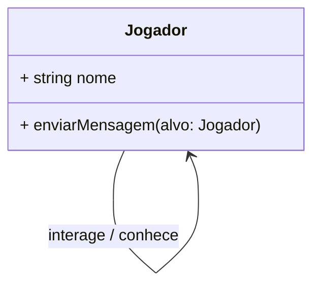
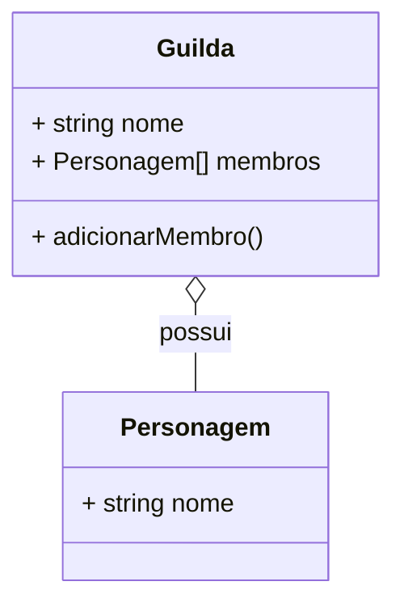
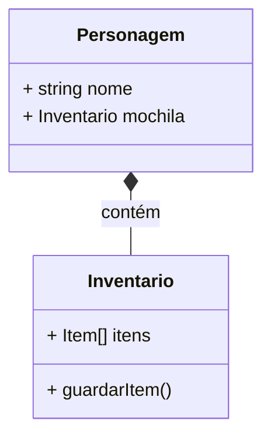

# Apostila Teórica: Relacionamentos e Arrays (Aulas 43-49)

**Projeto base:** Aetheria Engine

Até a última aula, criamos o núcleo do nosso motor com `Guerreiros` e `Magos` usando Herança e Polimorfismo. Mas um jogo não é feito de classes isoladas. Personagens entram em **Guildas**, carregam um **Inventário**, e equipam **Armas**. 

Para que o nosso sistema ganhe vida, os objetos precisam interagir e pertencer uns aos outros. Em Orientação a Objetos, chamamos isso de **Relacionamentos**.

---

## 1. Associação (O Relacionamento Básico)
A Associação é o relacionamento mais simples. Indica que uma classe "conhece" a outra e se comunica com ela, mas **nenhuma é dona da outra**.

> **Exemplo Clássico:** Um `Jogador` envia uma mensagem para outro `Jogador`, ou um `Personagem` usa uma `Mocao`.

### Representação em UML (Mermaid)
Em UML, a Associação é representada por uma simples linha contínua (com ou sem seta de direção). No Mermaid, usamos `-->`.



---

## 2. Agregação (Losango Branco) - "Tem-um" mas independente
A Agregação ocorre quando uma classe **é formada por um conjunto** de outras classes, mas os itens **podem existir independentemente**. É um relacionamento de "Todo-Parte" onde o Todo não destrói a Parte.

> **Exemplo Clássico:** Uma **Guilda** e seus **Personagens**.
> Se a Guilda for deletada/desfeita, os Personagens continuam existindo no jogo! A vida de um não depende do outro.

### Representação em UML (Mermaid)
Em UML, usamos uma linha com um **losango vazado (branco)** apontando para o dono (Todo). No Mermaid, usamos `o--`.



---

## 3. Composição (Losango Preto) - "É-parte-de" com Dependência Vital
A Composição é a versão "forte" da Agregação. Aqui, a parte **só existe se o Todo existir**. Se o Todo for destruído, a parte é destruída junto (Dependência Vital).

> **Exemplo Clássico:** Um **Personagem** e seu **Inventário**.
> Um Inventário não faz sentido e não existe flutuando no vácuo do jogo sem um dono. Se o Personagem for deletado do banco de dados, o Inventário dele é apagado imediatamente.

### Representação em UML (Mermaid)
Em UML, usamos um **losango preenchido (preto)** apontando para o dono. No Mermaid, usamos `*--`.



---

## 4. Como isso funciona no Código? (Manipulação de Arrays)

Seja Agregação ou Composição, no TypeScript nós implementamos esses relacionamentos guardando um Objeto (ou um Array de Objetos) dentro de outra Classe.

Para guardar vários objetos, usamos a sintaxe de colchetes `[]` para criar um Array tipado.

### Agregação no TypeScript (A Guilda)

```typescript
class Guilda {
    public nome: string;
    // Criando um Array vazio que só aceita a classe Personagem!
    public membros: Personagem[] = []; 

    constructor(nome: string) {
        this.nome = nome;
    }

    public recrutar(novoMembro: Personagem): void {
        // O método .push() adiciona o objeto no final do array
        this.membros.push(novoMembro);
        console.log(`${novoMembro.nome} entrou na guilda ${this.nome}!`);
    }
}
```

### Composição no TypeScript (O Inventário)

Na composição, o dono instancia a parte "escondido" dentro de si mesmo, garantindo que ela nasça e morra com ele.

```typescript
class Personagem {
    public nome: string;
    // O personagem TEM um inventário inteiro dentro de si
    public mochila: Inventario;

    constructor(nome: string) {
        this.nome = nome;
        // Instanciamos (new) a mochila no momento em que o Personagem nasce!
        this.mochila = new Inventario(); 
    }
}
```

---

### Dicas de Ouro para Manipular Arrays no TS
Quando você tem um array como `membros: Personagem[]`, você vai precisar destas 3 funções matemáticas internas do JavaScript/TypeScript:

1. **`.push(item)`** -> Adiciona um item novo no array.
2. **`.forEach(item => ...)`** -> Roda um "loop" passando por todos os itens (Ótimo para listar ou aplicar dano em área).
3. **`.length`** -> Retorna o tamanho do array. Útil para descobrir o limite de vagas na guilda (Ex: `if (membros.length >= 50) { ... }`).
